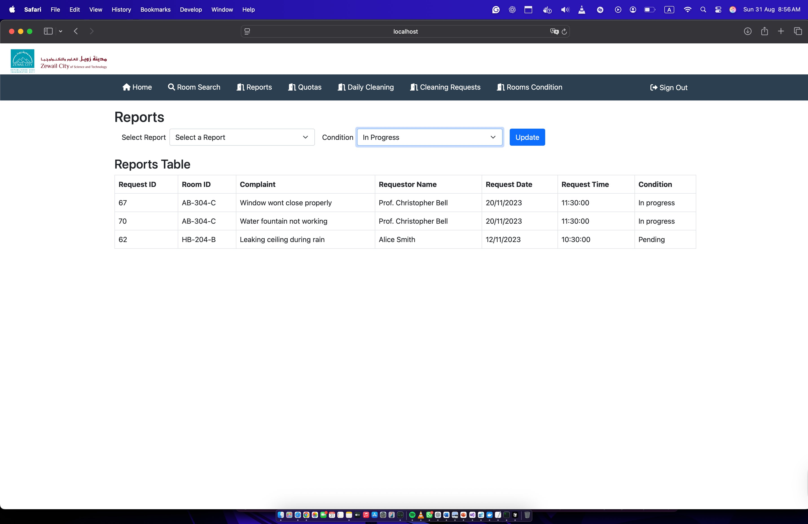
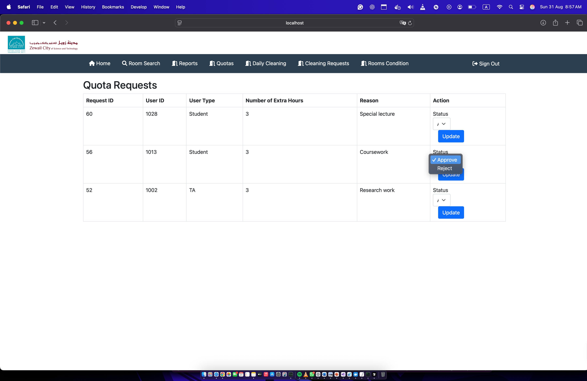
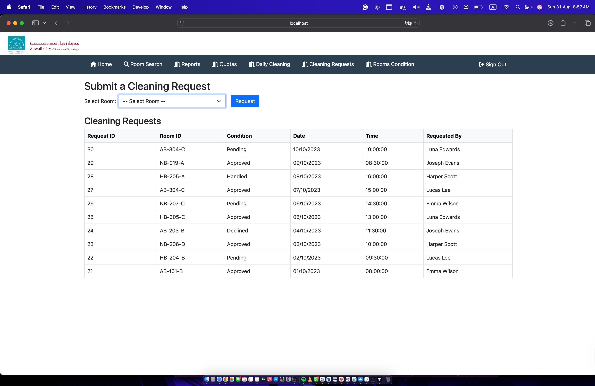
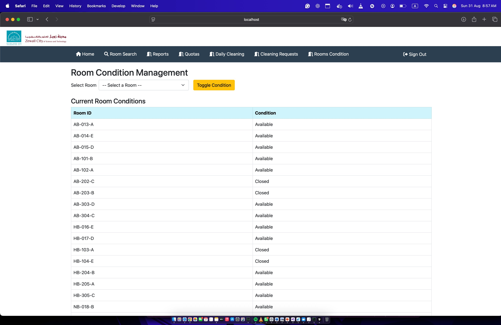
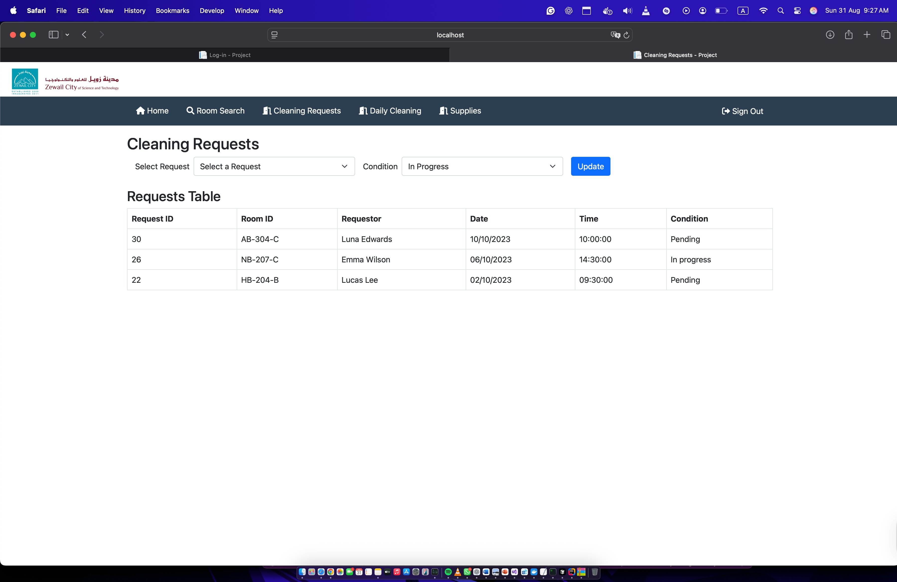
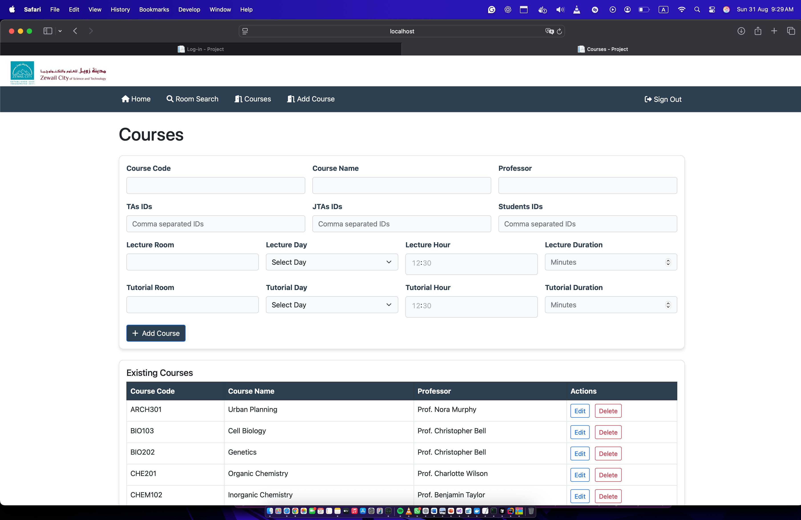
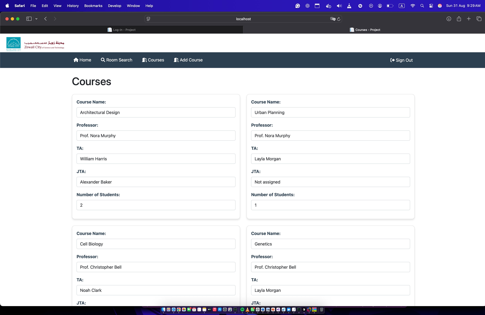

# University Room Management System

A full-stack university room booking and facility management web application built with **ASP.NET Core Razor Pages**, **C#**, **MSSQL**, and **Entity Framework Core**. Built from scratch as part of a university database systems project at Zewail City of Science and Technology.


---

## Overview

The University Room Management System is a multi-role web platform that handles room booking, course scheduling, cleaning operations, and facility reporting across a university campus. Each user type has a dedicated dashboard with role-specific functionality, backed by a fully relational MSSQL database.

The system was **built and tested live** with real sample data covering multiple buildings, rooms, courses, professors, students, TAs, and cleaning staff.

---

## Screenshots

### Reports Management
Facility reports with filterable conditions. Staff can update complaint statuses in real time.



### Quota Request Management
Room Services Team approves or rejects quota requests from Students and TAs.



### Cleaning Request Management
Cleaning staff submit and track room cleaning requests with real-time status updates.



### Room Condition Management
Toggle room availability (Available/Closed) across all campus buildings.



### Cleaning Staff Dashboard
Dedicated cleaning staff view for managing assigned cleaning requests.



### Course Management (Registrar)
Full course creation with lecture/tutorial scheduling, room assignment, and staff assignment.



### Course View (Professor/Student)
Card-based view showing enrolled courses with Professor, TA, JTA, and student count.



---

## Features

### Multi-Role Authentication
Six distinct user roles, each with a dedicated navigation menu and access-controlled pages:

| Role | Key Capabilities |
|------|-----------------|
| **Admin** | User management, system stats, create users |
| **Professor** | View assigned courses, room booking, submit reports |
| **Student** | Room search, booking, view courses, stats |
| **TA** | Room booking, quota requests, tutorial management |
| **Registrar** | Course creation/editing, room assignment, scheduling |
| **Cleaning Staff / Room Services** | Cleaning requests, daily cleaning, supplies, room conditions, quota approvals |

### Core Modules

**Room Search & Booking**
- Search available rooms by building, floor, zone, and capacity
- Book rooms for lectures or tutorials
- Real-time availability status tracking

**Reports System**
- Submit maintenance/complaint reports for specific rooms
- Filter by condition: Pending, In Progress, Resolved
- Update report conditions with dropdown actions

**Quota Request System**
- Students and TAs request extra room hours with justification
- Room Services Team approves or rejects requests
- Full audit trail with request timestamps

**Cleaning Management**
- Submit cleaning requests for specific rooms
- Daily cleaning schedule tracking
- Supply request management
- Room condition toggling (Available/Closed)

**Course Management (Registrar)**
- Full CRUD for courses: code, name, professor assignment
- Assign TAs, JTAs, and students via comma-separated IDs
- Schedule lecture and tutorial rooms with day/hour/duration
- Edit and delete existing courses

---

## Tech Stack

| Layer | Technology |
|-------|-----------|
| Backend | ASP.NET Core 8.0 — Razor Pages |
| Language | C# |
| ORM | Entity Framework Core (Code-First) |
| Database | Microsoft SQL Server (MSSQL) |
| Frontend | HTML, CSS, Bootstrap, JavaScript |
| Auth | Session-based login with role routing |
| Architecture | MVC-style Razor Pages |

---

## Database Schema

10+ relational tables covering every system entity:

```
User (UserID, Name, Email, Password, UserType)
├── Admin
├── Professor  
├── Student (Quota)
├── TA (Quota)
├── Registrar
├── CleaningStaffMember
└── RoomServicesMember

Room (ID, Building, Floor, Zone, Number, Capacity, AvailabilityStatus, DailyCleaningStatus)

Course (CourseCode, CourseName, ProfessorID, LectureRoom, LectureDay, ...)
├── CourseTA
├── CourseJTA  
└── CourseStudent

CleaningRequest (RequestID, RoomID, RequestedBy, Date, Time, Condition)
Report (RequestID, RoomID, Complaint, RequestorID, Date, Time, Condition)
QuotaRequest (RequestID, UserID, UserType, ExtraHours, Reason, Status)
```

Full schema SQL, ER diagram, relations diagram, and sample data are included in `/DataBase`.

---

## Project Structure

```
room-booking-system/
├── WebCode/
│   └── Project/
│       ├── Pages/
│       │   ├── Admin/
│       │   ├── Professor/
│       │   ├── Student/
│       │   ├── TA/
│       │   ├── Registrar/
│       │   ├── CleaningStaff/
│       │   ├── RoomServicesTeam/
│       │   ├── Login.cshtml
│       │   ├── Home.cshtml
│       │   └── RoomSearch.cshtml
│       ├── Models/
│       │   └── DB.cs           # EF Core context & all models
│       ├── Program.cs
│       └── appsettings.json
├── DataBase/
│   ├── Project Schema.sql
│   ├── Sample Data.sql
│   └── Pages Queries/          # SQL per page/role
├── Diagrams/
│   ├── Entities/               # ER diagram
│   ├── Relations/              # Relations diagram
│   ├── Schema/                 # Database schema
│   └── Website UI/             # UI wireframes for all roles
└── screenshots/                # Live app screenshots
```

---

## Getting Started

### Prerequisites
- .NET 8 SDK
- Microsoft SQL Server (or SQL Server Express)
- Visual Studio 2022 or VS Code with C# Dev Kit

### Setup

```bash
git clone https://github.com/Ahito498/room-booking-system.git
cd room-booking-system/WebCode
```

**1. Create the database**

Run in SQL Server Management Studio:
```sql
-- In order:
-- 1. DataBase/Project Schema.sql   (creates tables)
-- 2. DataBase/Sample Data.sql      (populates test data)
```

**2. Configure connection string** in `WebCode/Project/appsettings.json`:
```json
{
  "ConnectionStrings": {
    "DefaultConnection": "Server=YOUR_SERVER;Database=UniversityManagementSystem;Trusted_Connection=True;"
  }
}
```

**3. Run**
```bash
dotnet restore
dotnet run
```

Open `https://localhost:5001` — log in with any user from `Sample Data.sql`.

---

## Authors

Built by Communication and Information Engineering students at **Zewail City of Science and Technology**, Giza, Egypt.

Lead developer: **Hassan Ahmed Rashwan** — [github.com/Ahito498](https://github.com/Ahito498)

---

## License

MIT License
